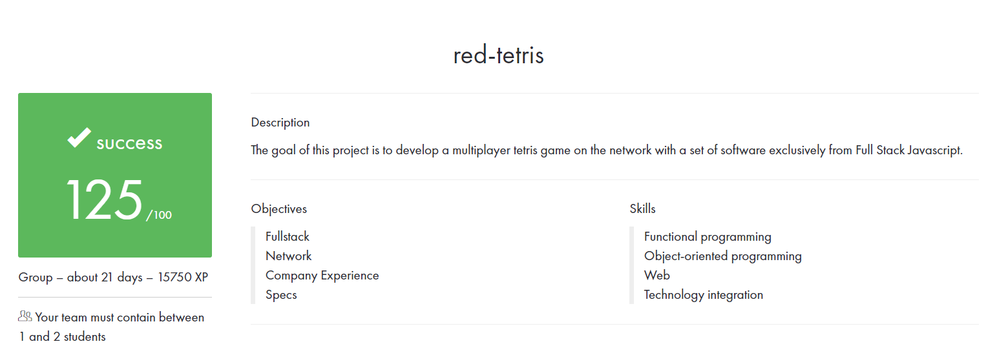

# RedTetris

[Live server](https://red-tetris-project.herokuapp.com/)

[21-school](https://21-school.ru/') project

The goal of this project is to develop a multiplayer tetris game on the network with a set of software exclusively
from Full Stack Javascript.

[Tetris](https://en.wikipedia.org/wiki/Tetris) is a puzzle game, whose subject is to contain falling pieces
as  long as possible in a Playground. The game is over when the field no longer offers enough
room for a new piece to fall. When one or more lines of land are complete, they disappear,
allowing to postpone the expiry of the game.
The game is based on these [basics](https://harddrop.com/wiki/Tetris_Wiki) but is played between several
players.

Each player has his own playing field, all players undergo the same series of pieces.
As soon as a player destroys lines on his ground, the opposing players receive n - 1 lines
in penalty, then indestructible, which fit at the bottom of their playground.
A [terrain](https://en.wikipedia.org/wiki/Tetromino) consists of 10 columns and 20 lines. Each player can
graphically observe the list of his opponents (name) and the specter of their land. For each column, a spectrum
indicates the first line occupied by a piece without providing any details about occupation
of the following lines. As soon as the terrain is updated, all opponents visualize the
evolution of their spectrum.

